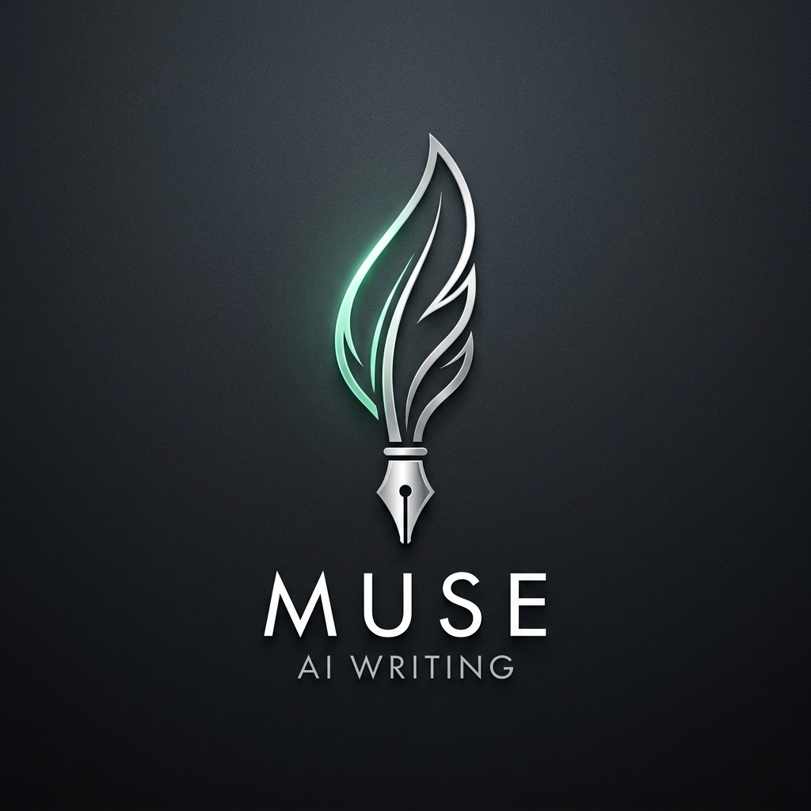
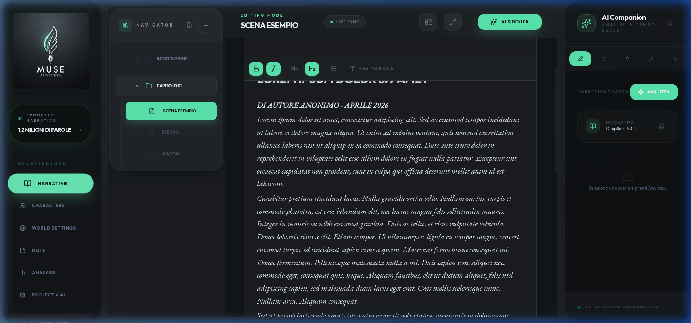

<div align="center">
  
  <h1>Project Muse</h1>
  <p><b>L'Architetto della tua Visione Narrativa</b></p>
  
  <p>
    
    
    
    
  </p>
</div>

---

**Project Muse** è una suite di scrittura creativa professionale progettata per trasformare frammenti di idee in narrativa strutturata. Con l'edizione *Inkwell*, l'interfaccia si evolve in un ambiente minimalista ad alto contrasto (Charcoal & Mint) studiato per massimizzare la concentrazione e l'immersione editoriale.



---

## 🚀 Visione Narrativa
L'applicazione non è un semplice editor di testo, ma un **Architetto Narrativo**. Integra intelligenza artificiale avanzata e strumenti di organizzazione gerarchica per supportare lo scrittore dalla prima bozza al manoscritto finale.

### 💎 Moduli Chiave

#### 🏰 Manuscript Navigator
Un sistema di gestione gerarchico che permette di muoversi tra capitoli e scene con estrema agilità. Supporta il reordering drag-and-drop tramite una struttura fluida e organizzata.

#### 🖋️ Pro Writing Editor
Un editor basato su TipTap e ProseMirror, ottimizzato per la modalità "Focus". Offre una barra degli strumenti **sticky** sempre visibile durante lo scorrimento, una tipografia di alta classe (EB Garamond per i contenuti, Outfit per l'interfaccia) e shortcut personalizzate per la punteggiatura narrativa.

#### 🤖 AI Sidekick (Concept 3 Engine)
L'assistente editoriale più avanzato di sempre. Alimentato da **Groq (Llama 3.3 70B)** e **DeepSeek V3**, il Sidekick analizza le tue scene in tempo reale offrendo:
- **Correzione Bozza**: Analisi ortografica e sintattica contestuale.
- **Modulazione Stilistica**: Trasforma il tono del testo (es. da "Noir" a "Descrittivo").
- **Espansione Concetti**: Aiuta a sviluppare intuizioni rapide in paragrafi strutturati.
- **Lexicon Engine**: Suggerimenti dinamici di sinonimi e metafore.

#### 📊 Analytical Dashboard
Monitora l'anatomia del tuo manoscritto con metriche in tempo reale:
- Word Count e densità testuale per capitolo.
- Analisi delle citazioni dei personaggi.
- Monitoraggio del pacing narrativo tramite grafici Area & Bar.
- Analisi del lessico e della ricchezza semantica.

#### 🎭 Character Matrix & World Nexus
Crea schede personaggi profonde (bio, psicologia, evoluzione) e mappa il tuo mondo (location, oggetti primari) con moduli dedicati che alimentano il contesto dell'intelligenza artificiale.

---

## 🛠️ Tech Stack
- **Frontend**: React 18 + TypeScript + Vite.
- **Styling**: Tailwind CSS (Custom Inkwell Theme: #0b0e11 / #5be9b1).
- **State Management**: Zustand (con Persistenza locale).
- **Backend**: Supabase (Auth, RLS, Database PostgreSQL).
- **AI Models**: Groq Llama 3.3, DeepSeek V3, Google Gemini Flash.

---

## 🏗️ Guida all'Installazione (Setup Rapido)

### 1. Clona il Repository
```bash
git clone https://github.com/placeholder-username/Muse.git
cd Muse
npm install
```

### 2. Configura Supabase
Importa il file [supabase_init.sql](supabase_init.sql) nel SQL Editor del tuo progetto Supabase. Questo creerà automaticamente:
- Tabelle e relazioni.
- Politiche di sicurezza (Row Level Security).
- Trigger per la creazione automatica dei profili utente.

### 3. Variabili d'Ambiente (.env)
Crea un file `.env` nella root del progetto:
```env
VITE_SUPABASE_URL=tua_url_supabase
VITE_SUPABASE_ANON_KEY=tua_key_anon_supabase
VITE_ALLOWED_EMAIL=user-email@example.com
VITE_GROQ_API_KEY=tua_key_groq
```

### 4. Avvia il Motore
```bash
npm run dev
```

---

## 🌑 Estetica Inkwell
L'estetica **Inkwell** è stata progettata per ridurre l'affaticamento visivo. Utilizza una base carbone profonda con accenti "Mint Tech" che evidenziano solo ciò che conta: la tua storia.

---
*Developed with ❤️ by Google DeepMind Team - Advanced Agentic Coding.*
